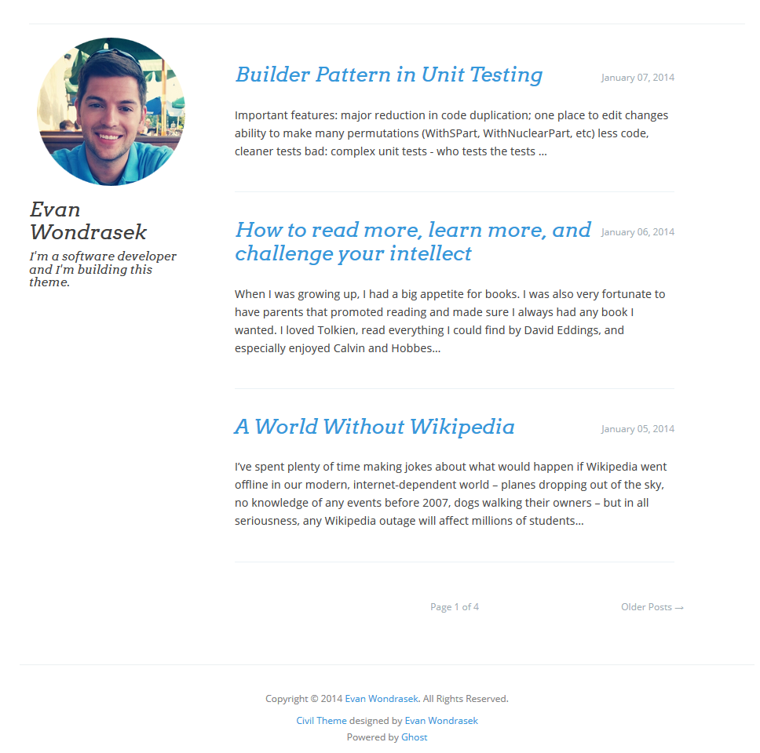

Civil, a theme for Ghost
=================

Civil is a clean, simple and responsive theme for the Ghost blogging platform (http://ghost.org).

## Features

- Exceedingly clean and minimal
- Responsive (built with Bootstrap)
- Pleasant, readable typography
- Modular: Use partial templates to customize the theme, while still allowing the base theme to be upgraded

## How to Install (for Ghost 0.3)

**Step 0:** Install [Ghost](https://ghost.org/).

**Step 1:** In the folder where you've installed Ghost, navigate to `content/themes/`.

**Step 2:** Git clone the `civil-ghost-theme`.

**Step 3:** Restart Ghost.

**Step 4:** In the Ghost Dashboard, navigate to **Settings**, and in the **General** tab, locate **Theme** and select **civil**. Click **Save**.

## Screenshots

### Desktop

### Responsive (small screens / mobile)

### Styling

For base styling, this theme uses a modified version of https://github.com/thomaspark/bootswatch, located at https://github.com/evanwon/bootswatch. (Bootswatch is, itself, based on https://github.com/twbs/bootstrap). 

My goal is to modify this base stylesheet as little as possible, and instead add any customizations to `assets/custom.css`.

If modification of the base bootswatch stylesheet is required, please modify the appropriate .less files and recompile to CSS.
